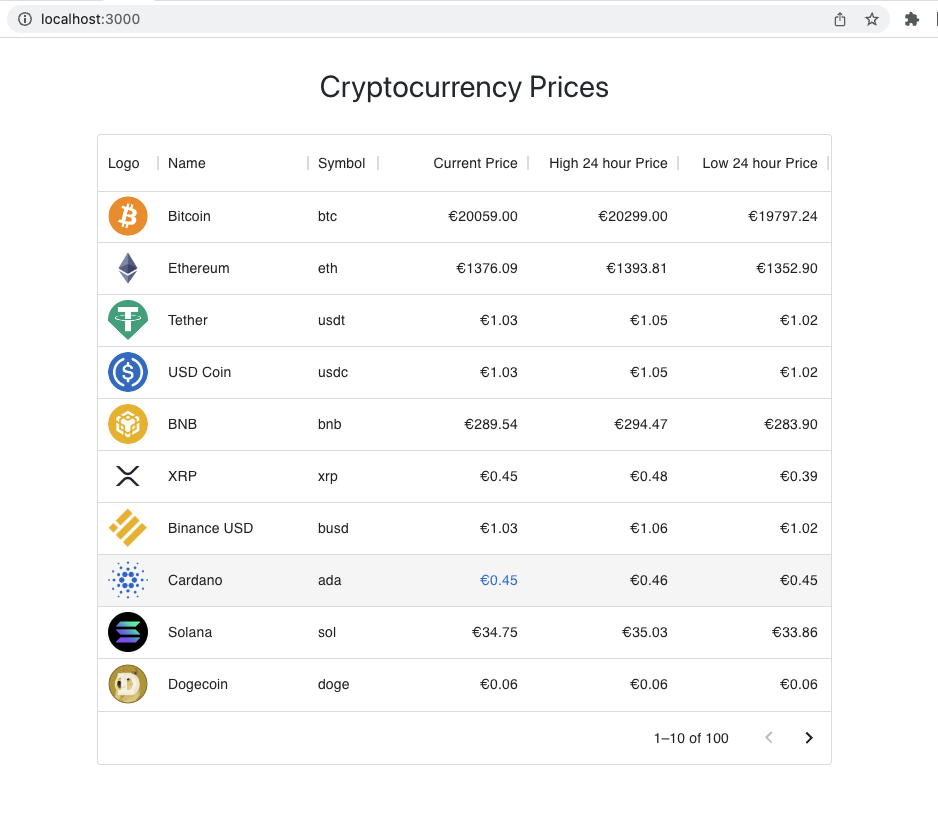
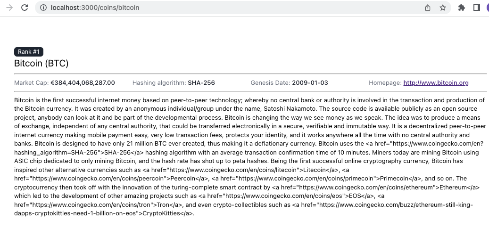

# React CoinGecko  

A simple React app to display the coins available on [CoinGecko API](https://www.coingecko.com/api/documentations/v3#/)

## Prerequisites  
<strong>Node</strong> v16.13.1  
<strong>npm</strong> v8.1.2  
<strong>yarn</strong> v1.22.18  

## Available Scripts

In the project directory, you can run:

### `yarn` or `yarn install`  
Installs the required dependencies.  

### `yarn start`

Runs the app in the development mode.\
Open [http://localhost:3000](http://localhost:3000) to view it in the browser.

The page will reload if you make edits.\
You will also see any lint errors in the console.

## HomePage  
  

## Coin Details  

